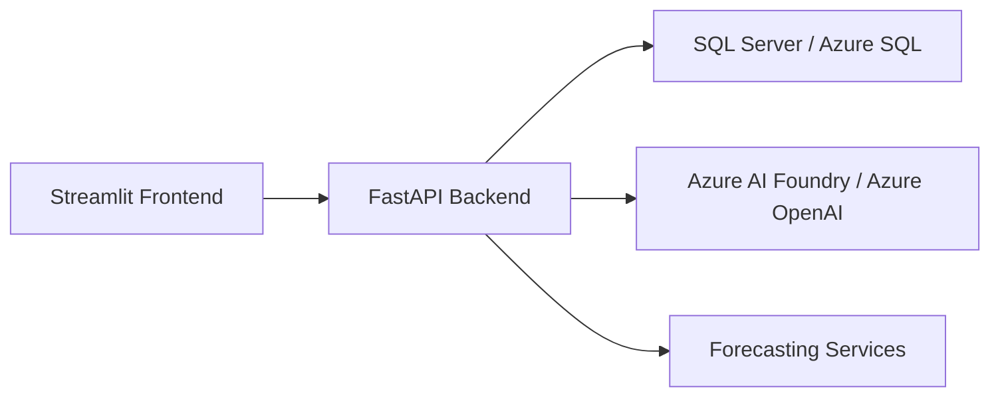

# AdventureWorks AI Platform

A production-style portfolio project that combines AdventureWorks data, Azure services, FastAPI, Streamlit, forecasting, and generative AI.

## Architecture Diagram



## Repository Structure

```text
adventureworks-ai-platform/
├── backend/
├── frontend/
├── sql/
├── docs/
├── scripts/
├── .github/
├── .env.example
├── README.md
└── docker-compose.yml
```

## Local Setup

1. Create a Python virtual environment.
2. Install backend dependencies:
   ```bash
   pip install -r backend/requirements.txt
   ```
3. Install frontend dependencies:
   ```bash
   pip install -r frontend/requirements.txt
   ```
4. Copy `.env.example` to `.env` and fill in your database and Azure values.

## Running FastAPI

```bash
cd backend
uvicorn app.main:app --reload
```

## Running Streamlit

```bash
cd frontend
streamlit run app.py
```

## Azure Deployment Roadmap

- Provision Azure SQL Database and import AdventureWorksDW sample data.
- Connect the backend to Azure SQL with managed identity or secrets.
- Deploy the FastAPI service to Azure Container Apps or App Service.
- Deploy the Streamlit frontend to Azure Static Web Apps or Container Apps.
- Integrate Azure AI Foundry and Azure OpenAI for chat and analytics.

## Future AI Roadmap

- Replace mock endpoints with enterprise-grade warehouse queries.
- Add Prophet-based forecasting and scenario analysis.
- Introduce Retrieval-Augmented Generation (RAG) over business docs.
- Add observability, CI/CD, and authentication.
